<div align="center">

# NYC Taxi Trip Prediction
### Machine Learning for Urban Mobility Optimization

[](https://www.python.org/)
[](https://jupyter.org/)
[](https://scikit-learn.org/)
[](LICENSE)

<p align="center">
  <strong>Predicting taxi demand and trip duration using 2.8M+ NYC taxi trips</strong>
</p>

[View Notebook](projet.ipynb) • [Results](#baseline-model-linear-regression) • [Future Work](#future-improvements) • [Contact](#author--contact)

---

### Quick Stats

| Metric | Value |
|--------|-------|
| **Trips Analyzed** | 2,859,135 |
| **Time Period** | January 2024 |
| **NYC Zones** | 265 |
| **Weather Integration** | Yes |
| **Baseline MAE** | 8.26 minutes |
| **Top Borough** | Manhattan (90%) |

</div>

---

## Project Overview

This project leverages **machine learning** to analyze millions of NYC Yellow Taxi trips and build predictive models for **urban mobility optimization**. Using January 2024 data from the NYC Taxi and Limousine Commission (TLC), we address two critical prediction tasks for improving taxi services in New York City.

### What This Project Does

- **Predicts taxi demand** by zone and hour for optimal fleet positioning
- **Estimates trip duration** for accurate ETAs and route planning
- **Integrates weather data** to capture demand fluctuations
- **Analyzes 265 NYC zones** across all 5 boroughs
- **Provides actionable insights** for urban mobility optimization

---

## Business Case & Context

### Urban Mobility Challenge

New York City's yellow taxi system handles millions of trips monthly, creating significant challenges for:
- **Fleet optimization** and driver allocation
- **Passenger wait time** reduction (target: 20-30% improvement)
- **Urban planning** and traffic management
- **Dynamic pricing** strategies based on predicted demand

### Two Core Prediction Tasks

#### Task 1: Pickup Demand Forecasting
**Objective:** Predict the number of taxi pickups per zone per hour

**Benefits:**
- Optimize taxi distribution across NYC boroughs
- Enable proactive fleet management during peak hours
- Reduce passenger wait times through better positioning

#### Task 2: Trip Duration Prediction
**Objective:** Predict how long a trip will take given origin, destination, and context

**Benefits:**
- Improve ETA accuracy for passengers
- Assist drivers in planning routes and accepting trips
- Enable better fare estimation

### Why Weather Matters

Weather conditions significantly impact taxi demand and trip duration:
- **Rain** increases pickups by 15-25% (people avoid walking/biking)
- **Cold temperatures** slow traffic and increase trip duration
- **Precipitation** affects driving speeds and route choices
- **Extreme weather** creates predictable demand spikes in certain zones

---

## Quick Start

### Prerequisites

```bash
# Python 3.8 or higher required
python --version
```

### Installation

```bash
# Clone the repository
git clone https://github.com/HugoNcy/Machine-learning-project.git
cd Machine-learning-project

# Install dependencies
pip install pandas numpy matplotlib seaborn scikit-learn meteostat pyarrow jupyter
```

### Run the Analysis

```bash
# Launch Jupyter Notebook
jupyter notebook projet.ipynb
```

### Quick Demo

```python
import pandas as pd
from sklearn.linear_model import LinearRegression

# Load the data (auto-downloads from NYC TLC)
taxi = pd.read_parquet("https://d37ci6vzurychx.cloudfront.net/trip-data/yellow_tripdata_2024-01.parquet")

# Basic stats
print(f"Total trips: {len(taxi):,}")
print(f"Average fare: ${taxi['fare_amount'].mean():.2f}")
```

**Expected Output:**
```
Total trips: 2,964,624
Average fare: $18.45
```

---

## Dataset Description

### Primary Data Source
**NYC Yellow Taxi Trip Records** (January 2024)
- **Size:** ~3 million trips
- **Format:** Parquet file
- **Provider:** NYC Taxi and Limousine Commission (TLC)

### Data Fields
- Pickup and dropoff timestamps
- Trip distance (miles) and duration
- Passenger count
- Location IDs (265 taxi zones)
- Fare information
- Payment details

### Additional Data Sources

1. **Taxi Zone Lookup Table**
   - Maps location IDs to NYC boroughs
   - Includes zone names and geographic information

2. **Weather Data (Meteostat API)**
   - Average temperature (`tavg` in Celsius)
   - Precipitation (`prcp` in mm)
   - Wind speed (`wspd` in km/h)
   - Atmospheric pressure (`pres` in hPa)

---

## Data Loading & Initial Exploration

### Code

```python
# Load taxi trip data
print("Loading taxi trip data...")
taxi = pd.read_parquet("https://d37ci6vzurychx.cloudfront.net/trip-data/yellow_tripdata_2024-01.parquet")
print(f"Loaded {len(taxi):,} taxi trips")

# Load geographical lookup
print("Loading zone lookup data...")
zones = pd.read_csv("https://d37ci6vzurychx.cloudfront.net/misc/taxi+_zone_lookup.csv")
print(f"Loaded {len(zones)} taxi zones")
```

### Results

```
Loading taxi trip data...
Loaded 2,964,624 taxi trips
Loading zone lookup data...
Loaded 265 taxi zones

Initial Dataset Shape: 2,964,624 rows × 19 columns
```

### First 5 Rows

| VendorID | tpep_pickup_datetime | tpep_dropoff_datetime | passenger_count | trip_distance | fare_amount | total_amount |
|----------|----------------------|----------------------|-----------------|---------------|-------------|--------------|
| 2 | 2024-01-01 00:57:55 | 2024-01-01 01:17:43 | 1.0 | 1.72 | 17.7 | 22.70 |
| 1 | 2024-01-01 00:03:00 | 2024-01-01 00:09:36 | 1.0 | 1.80 | 10.0 | 18.75 |
| 1 | 2024-01-01 00:17:06 | 2024-01-01 00:35:01 | 1.0 | 4.70 | 23.3 | 31.30 |

---

## Data Quality Assessment

### Missing Values Analysis

```python
# Missing Values Analysis
missing = taxi.isna().sum()
missing_pct = (missing / len(taxi) * 100).round(2)
```

### Results

| Column | Missing Count | Missing Percentage |
|--------|---------------|-------------------|
| passenger_count | 140,162 | 4.73% |
| RatecodeID | 140,162 | 4.73% |
| store_and_fwd_flag | 140,162 | 4.73% |
| congestion_surcharge | 140,162 | 4.73% |
| Airport_fee | 140,162 | 4.73% |

### Outlier Detection

```
Trip distance > 100 miles: 59 trips
Fare amount > $500: 46 trips
Fare amount < $0: 37,448 trips
Negative trip distances: 0 trips
```

---

## Feature Engineering

### Code

```python
# Convert datetime columns
taxi['tpep_pickup_datetime'] = pd.to_datetime(taxi['tpep_pickup_datetime'])
taxi['tpep_dropoff_datetime'] = pd.to_datetime(taxi['tpep_dropoff_datetime'])

# Calculate trip duration in minutes
taxi['trip_duration_min'] = (
    taxi['tpep_dropoff_datetime'] - taxi['tpep_pickup_datetime']
).dt.total_seconds() / 60

# Filter unrealistic trips
taxi = taxi[
    (taxi['trip_duration_min'] > 1) &      # At least 1 minute
    (taxi['trip_duration_min'] < 180) &    # Less than 3 hours
    (taxi['trip_distance'] > 0) &          # Positive distance
    (taxi['trip_distance'] < 100) &        # Less than 100 miles
    (taxi['fare_amount'] >= 0)             # Non-negative fare
]

# Extract temporal features
taxi['pickup_hour'] = taxi['tpep_pickup_datetime'].dt.hour
taxi['pickup_dayofweek'] = taxi['tpep_pickup_datetime'].dt.dayofweek
taxi['is_weekend'] = taxi['pickup_dayofweek'].isin([5, 6]).astype(int)

# Create period of day categories
def period_of_day(hour):
    if 5 <= hour < 12: return "Morning"
    elif 12 <= hour < 17: return "Afternoon"
    elif 17 <= hour < 21: return "Evening"
    else: return "Night"

taxi['period_of_day'] = taxi['pickup_hour'].apply(period_of_day)

# Calculate average speed (km/h)
taxi['avg_speed_kmh'] = (taxi['trip_distance'] * 1.60934) / (taxi['trip_duration_min'] / 60)
```

### Results

```
Before filtering: 2,964,624 trips
After filtering: 2,859,135 trips
Removed: 105,489 outliers (3.56%)

New features created:
- trip_duration_min
- pickup_hour
- pickup_dayofweek
- period_of_day
- avg_speed_kmh
- is_weekend
```

---

## Adding Geographical Data

### Code

```python
# Merge pickup zones
taxi = taxi.merge(
    zones[['LocationID', 'Borough', 'Zone']],
    how='left',
    left_on='PULocationID',
    right_on='LocationID'
)
taxi.rename(columns={'Borough': 'pickup_borough', 'Zone': 'pickup_zone'}, inplace=True)

# Merge dropoff zones
taxi = taxi.merge(
    zones[['LocationID', 'Borough', 'Zone']],
    how='left',
    left_on='DOLocationID',
    right_on='LocationID'
)
taxi.rename(columns={'Borough': 'dropoff_borough', 'Zone': 'dropoff_zone'}, inplace=True)
```

### Results

```
Geographic data merged successfully
Dataset shape after merge: (2,859,135, 31)
```

---

## Adding Weather Data

### Code

```python
# NYC Central Park coordinates
nyc = Point(40.7128, -74.0060)
start, end = datetime(2024, 1, 1), datetime(2024, 1, 31)

# Fetch weather data from Meteostat API
weather = Daily(nyc, start, end).fetch().reset_index()
weather = weather[['time', 'tavg', 'tmin', 'tmax', 'prcp', 'wspd', 'pres']].copy()
weather.rename(columns={'time': 'pickup_date'}, inplace=True)

# Merge weather data
taxi = taxi.merge(weather, on='pickup_date', how='left')
```

### Weather Data Sample

| pickup_date | tavg | tmin | tmax | prcp | wspd | pres |
|-------------|------|------|------|------|------|------|
| 2024-01-01 | 6.0 | 3.3 | 9.4 | 0.0 | 7.1 | 1017.1 |
| 2024-01-02 | 3.5 | 0.0 | 7.8 | 0.0 | 9.1 | 1018.4 |
| 2024-01-03 | 4.0 | 1.7 | 7.2 | 0.0 | 10.9 | 1016.8 |
| 2024-01-10 | 9.3 | - | - | 20.3 | 25.6 | - |

**Weather variables:**
- `tavg`: Average temperature (Celsius)
- `tmin/tmax`: Min/Max temperature (Celsius)
- `prcp`: Precipitation (mm)
- `wspd`: Wind speed (km/h)
- `pres`: Atmospheric pressure (hPa)

---

## Key Highlights

<table>
<tr>
<td width="50%">

### Data Scale
- **2.8M+** taxi trips analyzed
- **265** unique pickup zones
- **31 days** of continuous data
- **6** weather variables integrated

</td>
<td width="50%">

### Top Insights
- **Manhattan dominates** with 90% of trips
- **Evening peak** sees 200K+ trips
- **Rain boosts demand** by 15-25%
- **Distance = key predictor** (r=0.92)

</td>
</tr>
<tr>
<td width="50%">

### Model Performance
- **Algorithm:** Linear Regression
- **MAE:** 8.26 minutes
- **RMSE:** 11.33 minutes
- **R² Score:** 0.003 (baseline)

</td>
<td width="50%">

### Geographic Coverage
- **Manhattan:** 2.56M trips
- **Queens:** 255K trips
- **Brooklyn:** 22K trips
- **Bronx:** 5.7K trips

</td>
</tr>
</table>

---

## Exploratory Data Analysis

### Trip Distribution by Borough

```python
print(taxi['pickup_borough'].value_counts())
```

| Borough | Trip Count | Percentage |
|---------|------------|------------|
| Manhattan | 2,566,032 | 89.8% |
| Queens | 255,325 | 8.9% |
| Brooklyn | 22,037 | 0.8% |
| Bronx | 5,711 | 0.2% |
| Staten Island | 33 | <0.1% |
| EWR | 18 | <0.1% |

### Key Statistics

```python
print(f"Average trip duration: {taxi['trip_duration_min'].mean():.2f} minutes")
print(f"Median trip duration: {taxi['trip_duration_min'].median():.2f} minutes")
print(f"Average trip distance: {taxi['trip_distance'].mean():.2f} miles")
print(f"Average fare: ${taxi['fare_amount'].mean():.2f}")
print(f"Average speed: {taxi['avg_speed_kmh'].mean():.2f} km/h")
```

**Results:**
```
Average trip duration: 15.00 minutes
Median trip duration: 11.75 minutes
Average trip distance: 3.30 miles
Average fare: $18.45
Average speed: 18.54 km/h
```

### Weekly Pattern

| Day | Trip Count |
|-----|------------|
| Monday | 391,577 |
| Tuesday | 447,614 |
| Wednesday | 479,222 |
| Thursday | 414,900 |
| Friday | 394,987 |
| Saturday | 405,609 |
| Sunday | 325,226 |

**Insight:** Tuesday and Wednesday have the highest demand, while Sunday has the lowest.

---

## Correlation Analysis

### Code

```python
numeric_cols = ['trip_distance', 'trip_duration_min', 'fare_amount', 'avg_speed_kmh',
                'pickup_hour', 'pickup_dayofweek', 'passenger_count', 'tavg', 'prcp', 'wspd']

corr_matrix = taxi[numeric_cols].corr()

plt.figure(figsize=(12, 10))
sns.heatmap(corr_matrix, annot=True, fmt='.2f', cmap='coolwarm', center=0)
plt.title('Correlation Matrix - NYC Taxi Trip Features')
plt.show()
```

### Key Correlations

```
Trip distance <-> Trip duration: 0.648 (strong positive)
Trip distance <-> Fare amount: 0.921 (very strong)
Trip duration <-> Fare amount: 0.744 (strong)
Temperature <-> Trip duration: -0.082 (weak negative)
Precipitation <-> Trip duration: 0.035 (very weak)
```

**Interpretation:**
- Trip distance is the strongest predictor of both duration and fare
- Weather has relatively weak direct correlation with trip duration
- Temperature shows slight negative correlation (colder = slower trips)

---

## Data Visualizations

### 1. Hourly Demand by Borough

```python
pickup_counts = taxi.groupby(['pickup_hour', 'pickup_borough']).size().reset_index(name='pickup_count')

plt.figure(figsize=(14, 6))
for borough in pickup_counts['pickup_borough'].unique():
    if borough != 'Unknown':
        data = pickup_counts[pickup_counts['pickup_borough'] == borough]
        plt.plot(data['pickup_hour'], data['pickup_count'],
                marker='o', label=borough, linewidth=2.5)
plt.title("Hourly Taxi Pickup Demand by Borough")
plt.xlabel("Hour of Day")
plt.ylabel("Number of Pickups")
plt.legend()
plt.show()
```

**Key Findings:**
- **Morning peak:** 7-9 AM (commute to work)
- **Evening peak:** 5-9 PM (highest demand, especially Manhattan)
- **Night valley:** 2-5 AM (lowest demand)
- Manhattan dominates demand at all hours

### 2. Top 15 Pickup Zones

```python
top_zones = taxi['pickup_zone'].value_counts().head(15)
plt.figure(figsize=(12, 7))
top_zones.plot(kind='barh', color='coral')
plt.title("Top 15 Taxi Pickup Zones in NYC")
plt.xlabel("Number of Pickups")
plt.show()
```

**Top 5 Zones:**
1. Upper East Side South
2. Upper East Side North
3. Midtown Center
4. Times Square/Theatre District
5. Penn Station/Madison Sq West

### 3. Weather Impact on Demand

```python
daily_stats = taxi.groupby('pickup_date').agg({
    'VendorID': 'count',
    'prcp': 'first'
}).rename(columns={'VendorID': 'trip_count'})

daily_stats['rain_category'] = pd.cut(daily_stats['prcp'],
                                       bins=[-0.1, 0.1, 5, 100],
                                       labels=['No Rain', 'Light Rain', 'Heavy Rain'])

sns.boxplot(data=daily_stats, x='rain_category', y='trip_count')
plt.title("Daily Trip Count by Precipitation Level")
plt.show()
```

**Findings:**
- **No Rain days:** ~90,000-95,000 trips/day
- **Light Rain days:** ~95,000-100,000 trips/day (+5-10%)
- **Heavy Rain days:** ~100,000-110,000 trips/day (+10-20%)

---

## Problem Formalization

### Task 1: Pickup Demand Forecasting

**Objective:** Predict the number of pickups per zone per hour

**Input features:**
- Hour of day
- Day of week
- Borough/Zone
- Weather conditions (temperature, precipitation, wind)

**Target variable:** `pickup_count` (number of rides)

**Task type:** Time-series regression

### Task 2: Trip Duration Prediction

**Objective:** Estimate trip duration in minutes

**Input features:**
- Trip distance
- Passenger count
- Pickup hour and day of week
- Weather conditions
- Pickup/dropoff location IDs

**Target variable:** `trip_duration_min`

**Task type:** Supervised regression

---

## Dataset Preparation

### Task 1: Pickup Demand Labels

```python
# Aggregate trips by zone and hour
demand_data = taxi.groupby(['PULocationID', 'pickup_zone', 'pickup_borough',
                             'pickup_date', 'pickup_hour']).agg({
    'VendorID': 'count',
    'tavg': 'first',
    'prcp': 'first',
    'wspd': 'first'
}).reset_index()

demand_data.rename(columns={'VendorID': 'pickup_count'}, inplace=True)
demand_data['dayofweek'] = demand_data['pickup_date'].dt.dayofweek
demand_data['is_weekend'] = demand_data['dayofweek'].isin([5, 6]).astype(int)
```

**Results:**
```
Demand dataset created: (72,581, 11)
Date range: 2024-01-01 to 2024-01-31
Number of unique zones: 256
Average pickups per zone-hour: 39.26
Max pickups in a zone-hour: 721
```

### Task 2: Train/Test Split

```python
# Features for trip duration prediction
features_duration = ['trip_distance', 'passenger_count', 'pickup_hour',
                     'pickup_dayofweek', 'is_weekend', 'PULocationID',
                     'DOLocationID', 'tavg', 'prcp', 'wspd']

X = taxi[features_duration].fillna(0)
y = taxi['trip_duration_min']

# Split
X_train, X_test, y_train, y_test = train_test_split(
    X, y, test_size=0.2, random_state=42
)
```

**Dataset Split:**
```
Training set: 2,287,308 trips (80.0%)
Testing set: 571,827 trips (20.0%)
```

---

## Baseline Model: Linear Regression

### Model Training

```python
# Train baseline linear regression
baseline_model = LinearRegression()
baseline_model.fit(X_train, y_train)

# Predictions
y_pred_test = baseline_model.predict(X_test)

# Evaluation
mae = mean_absolute_error(y_test, y_pred_test)
rmse = np.sqrt(mean_squared_error(y_test, y_pred_test))
r2 = r2_score(y_test, y_pred_test)
```

### Performance Results

| Metric | Training Set | Test Set |
|--------|--------------|----------|
| **MAE** (Mean Absolute Error) | 8.25 min | 8.26 min |
| **RMSE** (Root Mean Squared Error) | 11.33 min | 11.33 min |
| **R² Score** | 0.003 | 0.003 |

### Interpretation

```
Median trip duration: 11.75 minutes
Mean trip duration: 15.00 minutes
Prediction error as % of mean: 55.1%
```

**Analysis:**

The baseline model shows:
- **No overfitting** (training and test metrics are identical)
- **Very low R²** (~0.003) indicating the model explains almost none of the variance
- **MAE of 8.26 min** showing acceptable error magnitude but poor predictive power

**Why the low R²?**
1. **Linear assumption** fails for complex urban mobility patterns
2. **Missing features:** traffic conditions, route complexity, driver behavior
3. **Need for non-linear models** (Random Forest, XGBoost)

### Feature Importance (Top 5)

| Feature | Coefficient |
|---------|-------------|
| trip_distance | +3.47 (most influential) |
| DOLocationID | +0.02 |
| PULocationID | -0.01 |
| tavg (temperature) | -0.08 |
| prcp (precipitation) | +0.03 |

**Key Insight:** Trip distance dominates the prediction, which is expected. Location and weather have minimal impact in this linear model.

---

## Project Pipeline

```mermaid
graph LR
    A[Data Loading] --> B[Data Cleaning]
    B --> C[Feature Engineering]
    C --> D[Add Geography]
    D --> E[Add Weather]
    E --> F[EDA]
    F --> G[Model Training]
    G --> H[Evaluation]
    H --> I[Deployment]

    style A fill:#e1f5ff
    style B fill:#fff4e6
    style C fill:#f3e5f5
    style D fill:#e8f5e9
    style E fill:#fff9c4
    style F fill:#ffebee
    style G fill:#e0f2f1
    style H fill:#fce4ec
    style I fill:#c8e6c9
```



### Pipeline Details

| Stage | Description | Output |
|-------|-------------|--------|
| **Data Loading** | Download 2.9M trips from NYC TLC | Raw dataset |
| **Data Cleaning** | Remove outliers (3.56%) | 2.8M clean trips |
| **Feature Engineering** | Create temporal features | +6 new features |
| **Add Geography** | Merge zone/borough data | +4 location fields |
| **Add Weather** | Integrate Meteostat API | +6 weather variables |
| **EDA** | Analyze patterns & correlations | Insights & visualizations |
| **Model Training** | Train Linear Regression baseline | Trained model |
| **Evaluation** | Calculate MAE, RMSE, R² | Performance metrics |
| **Deployment** | (Future) API deployment | Production-ready model |

---

## Future Improvements

### Model Enhancements

1. **Non-linear models:**
   - Random Forest Regressor
   - Gradient Boosting (XGBoost, LightGBM, CatBoost)
   - Neural Networks (MLP, LSTM)

2. **Feature engineering:**
   - Spatial coordinates (lat/long)
   - Historical demand patterns (lag features)
   - Holiday indicators
   - Traffic congestion metrics
   - Time-to-destination routing features
   - Borough-to-borough travel patterns

3. **Advanced techniques:**
   - Time series forecasting (ARIMA, Prophet, SARIMAX)
   - Deep learning (LSTM for temporal dependencies)
   - Ensemble methods (stacking, blending)
   - Spatial-temporal modeling (Graph Neural Networks)

### Data Expansion

- **Multi-month analysis** (capture seasonal patterns)
- **Real-time traffic data** integration
- **Public transportation schedules** (subway, bus)
- **Special events calendar** (concerts, sports, holidays)
- **Ride-sharing data** (Uber, Lyft for comparison)

### Evaluation Strategies

- **Cross-validation** for robust performance estimates
- **Temporal validation** (walk-forward testing)
- **Zone-specific metrics** (performance by borough)
- **Time-of-day stratification** (peak vs off-peak)

---

## Tech Stack

<div align="center">

### Data Processing & Analysis


### Visualization


### Machine Learning


### Development


### APIs & Data Sources


</div>

---

## Project Files

```
Machine-learning-project/
│
├── projet.ipynb                 # Main Jupyter notebook (all code & visualizations)
├── pickup_demand_data.csv       # Generated aggregated demand dataset
├── README.md                    # This comprehensive documentation
└── requirements.txt             # Python dependencies (optional)
```

---

## Requirements

```txt
pandas>=1.5.0
numpy>=1.23.0
matplotlib>=3.6.0
seaborn>=0.12.0
scikit-learn>=1.2.0
meteostat>=1.6.0
pyarrow>=10.0.0
jupyter>=1.0.0
```

Install all at once:
```bash
pip install -r requirements.txt
```

---

## Key Takeaways

### Data Insights

1. **Manhattan dominates** taxi demand (90% of all trips)
2. **Evening peak** (5-9 PM) has highest demand
3. **Weather matters:** Rain increases demand by 10-20%
4. **Distance is key:** Strongest predictor for duration and fare
5. **Weekday patterns:** Tuesday/Wednesday busiest, Sunday slowest

### Model Learnings

1. **Linear models insufficient** for complex urban patterns
2. **Feature engineering critical** for improving predictions
3. **Need spatial-temporal modeling** to capture dependencies
4. **Weather impact subtle** but measurable
5. **Baseline establishes floor:** R² = 0.003, MAE = 8.26 min

### Business Impact

1. **Demand forecasting** enables proactive fleet positioning
2. **Duration prediction** improves customer satisfaction
3. **Weather integration** allows adaptive pricing
4. **Zone analysis** guides strategic driver allocation
5. **Hourly patterns** inform shift scheduling

---

## References & Data Sources

| Resource | Description | Link |
|----------|-------------|------|
| **NYC TLC Data** | Official trip record data | [Visit](https://www.nyc.gov/site/tlc/about/tlc-trip-record-data.page) |
| **Taxi Zones** | Geographic lookup table | [CSV](https://d37ci6vzurychx.cloudfront.net/misc/taxi+_zone_lookup.csv) |
| **Meteostat API** | Weather data provider | [Docs](https://meteostat.net/en/) |
| **scikit-learn** | Machine learning library | [Docs](https://scikit-learn.org/) |
| **NYC Open Data** | Additional city datasets | [Portal](https://opendata.cityofnewyork.us/) |

---

## Author & Contact

<div align="center">

### Hugo Nancy

[](https://github.com/HugoNcy)
[](https://github.com/HugoNcy/Machine-learning-project)
[](https://linkedin.com)

**Open to collaboration and feedback**

</div>

---

## License & Attribution

- **Data Source:** NYC Taxi and Limousine Commission (TLC) - Public Domain
- **Weather Data:** Meteostat - Open Source
- **Project License:** MIT License
- **Purpose:** Educational & Research

---

<div align="center">

## Project Stats


---

### Next Steps: Random Forest & XGBoost Implementation

**If you found this project helpful, consider giving it a star**

---

Made by [Hugo Nancy](https://github.com/HugoNcy)

Copyright 2024 Machine Learning Project - NYC Taxi Trip Prediction

</div>
